# 서비스 주요 기능 및 시나리오

## 1. WebRTC를 이용한 멘토링 서비스

### 주요 기능
- **실시간 멘토링**: WebRTC 기술을 활용하여 단비와 새잎 간의 실시간 영상 및 음성 통신이 가능합니다.
- **화면 공유**: 멘토와 멘티가 화면을 공유하여 실시간으로 코딩 리뷰, 문서 설명 등을 진행할 수 있습니다.
- **채팅 기능**: 텍스트 기반의 실시간 채팅도 함께 제공하여 영상 통화 중에도 메시지를 주고 받을 수 있습니다.

### 시나리오
1. 새잎(멘티)가 원하는 시간대를 설정하여 팀을 찾고 신청을 합니다.
2. 멘토링 시작 3일전 팀이 확정됩니다.
3. 단비(멘토)와 새잎(맨티)간의 상호작용을 통해 식물을 키워나갈 수 있습니다.
4. WebRTC를 이용한 실시간 커뮤니케이션 멘토링이 가능합니다.
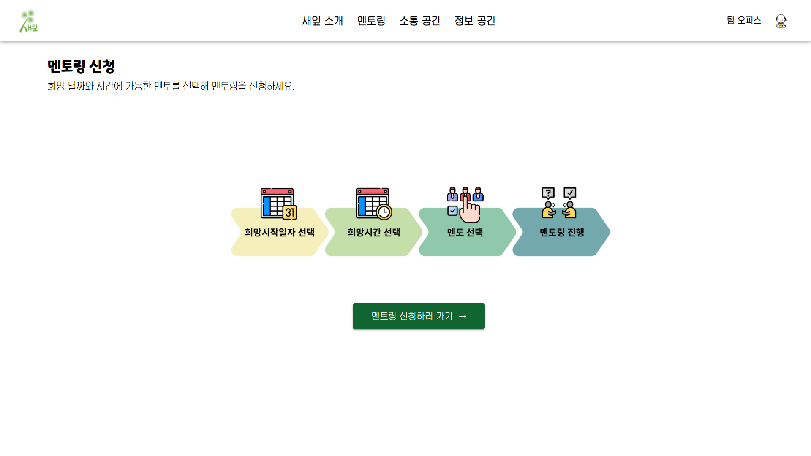
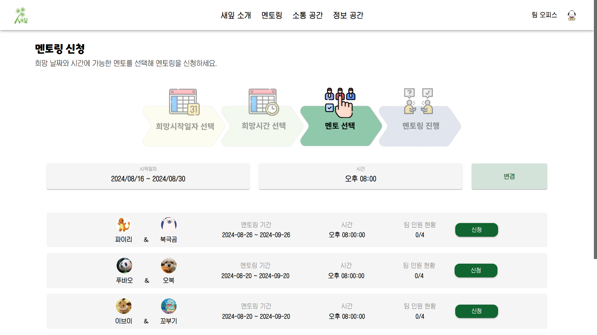
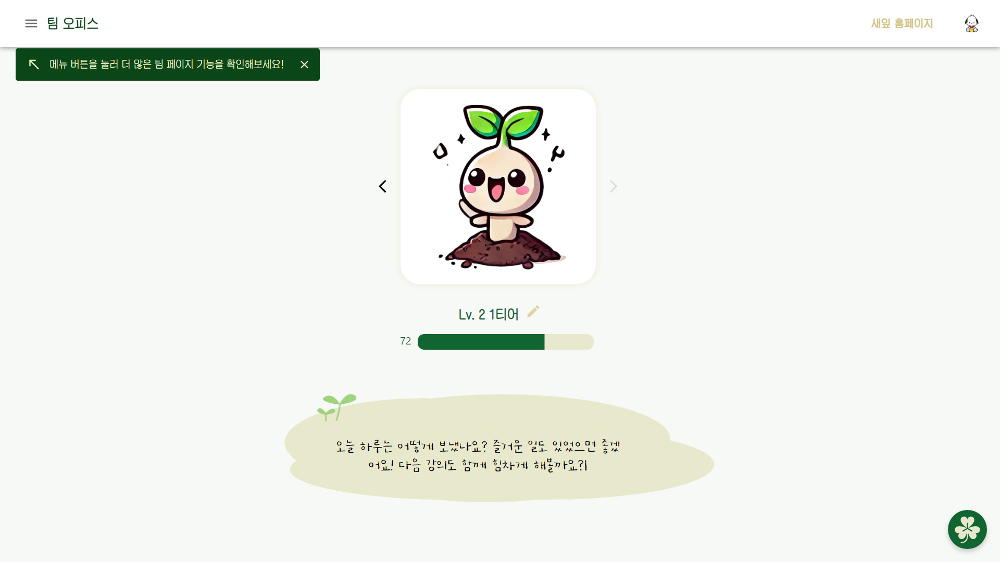
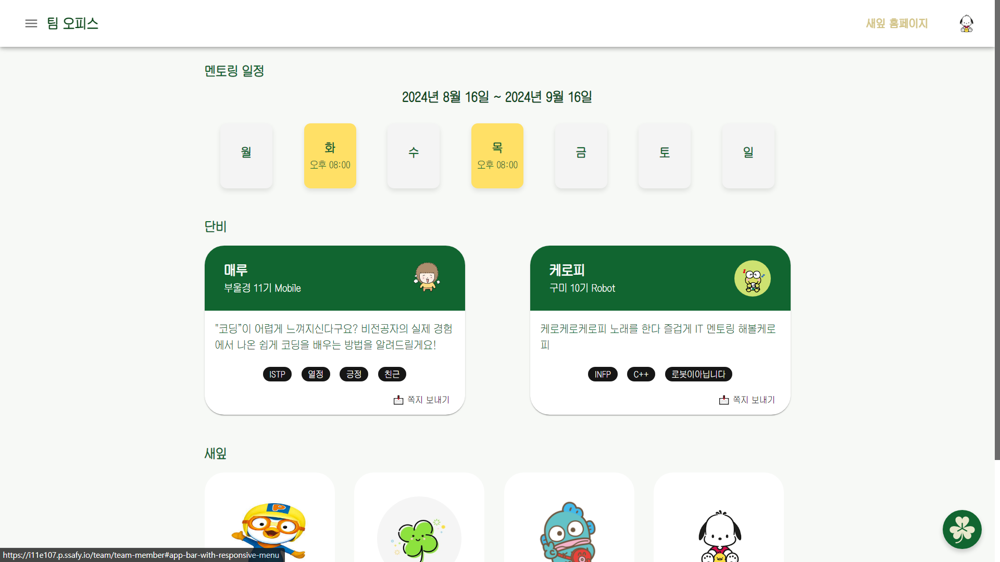
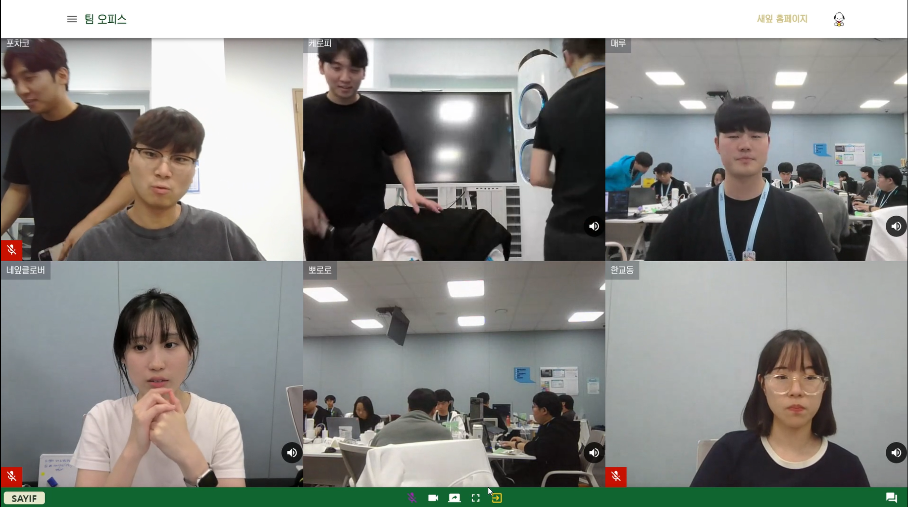

---

## 2. WebSocket을 이용한 단톡방

### 주요 기능
- **실시간 그룹 채팅**: WebSocket을 사용하여 다수의 사용자가 동시에 대화를 나눌 수 있는 단톡방 기능을 제공합니다.
- **읽음 확인 기능**: 메시지의 읽음 여부를 확인할 수 있어, 대화 진행 상황을 파악할 수 있습니다.
- **파일 전송**: 채팅 중에 이미지, 문서 등 파일을 주고 받을 수 있습니다.

### 시나리오
1. 사용자는 그룹 채팅방에 접속합니다.
2. 실시간으로 다른 사용자들과 메시지를 주고 받습니다.
3. 파일을 업로드하거나, 다른 사용자의 메시지를 읽은 상태를 확인합니다.
4. 채팅 내용은 서버에 저장되어 이후에도 다시 확인할 수 있습니다.

### 캡처 이미지
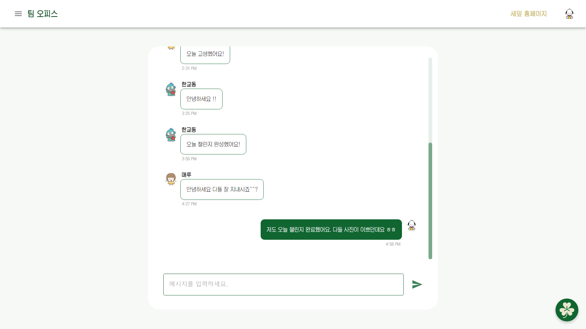

---

## 3. ResNet152을 이용한 이미지 분류 챌린지 서비스

### 주요 기능
- **이미지 분류**: ResNet152 모델을 활용하여 사용자가 업로드한 이미지를 분석하고 분류합니다.
- **챌린지 시스템**: 사용자는 매일 새로운 이미지 분류 챌린지에 참여하여 이미지를 제출할 수 있습니다.

### 시나리오
1. 사용자가 챌린지에 참가하기 위해 이미지를 업로드합니다.
2. ResNet152 모델이 이미지를 분석하고, 해당 이미지를 분류합니다.
3. 사용자는 자신의 분류 결과를 확인하고 제출합니다.

### 캡처 이미지
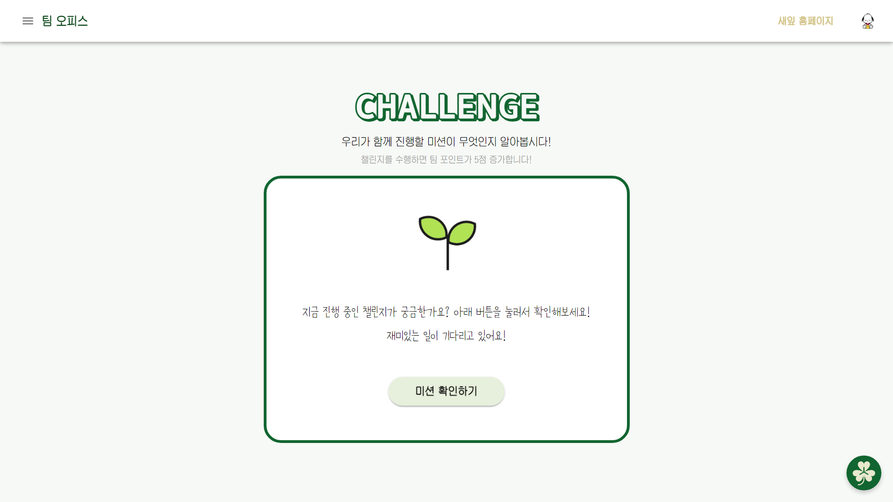
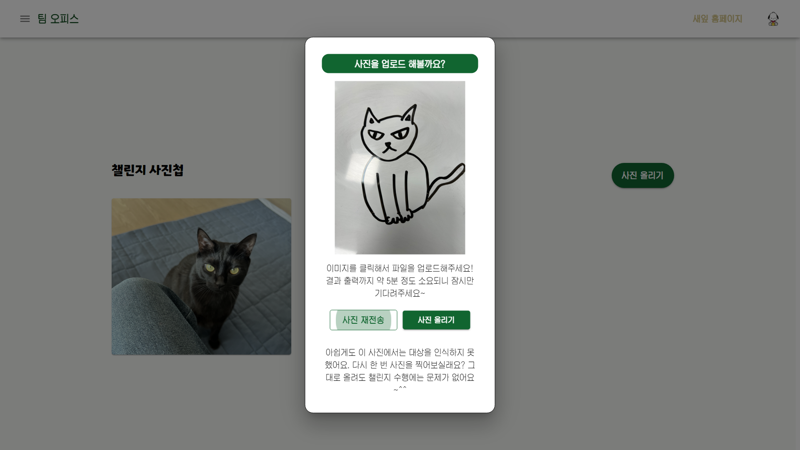
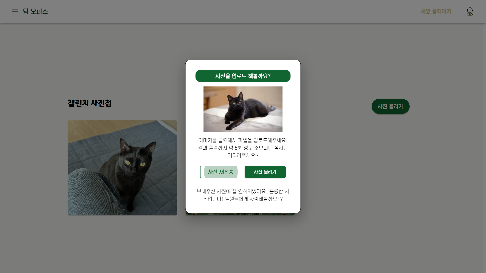

---

## 4. 웹 크롤링을 이용한 자립 정보 제공 서비스

### 주요 기능
- **자동 데이터 수집**: 웹 크롤링 기술을 활용하여 다양한 웹사이트에서 최신 자립 관련 정보(주거, 금융, 교육 등)를 자동으로 수집합니다.
- **맞춤형 정보 제공**: 자립 준비 청년에 대한 정보를 제공하며, 각종 지원 프로그램, 혜택 정보를 확인할 수 있습니다.

### 시나리오
1. 웹 크롤링을 통해 수집된 최신 정보가 사용자의 대시보드에 표시됩니다.
2. 사용자는 해당 정보를 확인하고, 필요 시 관련 링크를 통해 더 자세한 정보를 얻습니다.

### 캡처 이미지
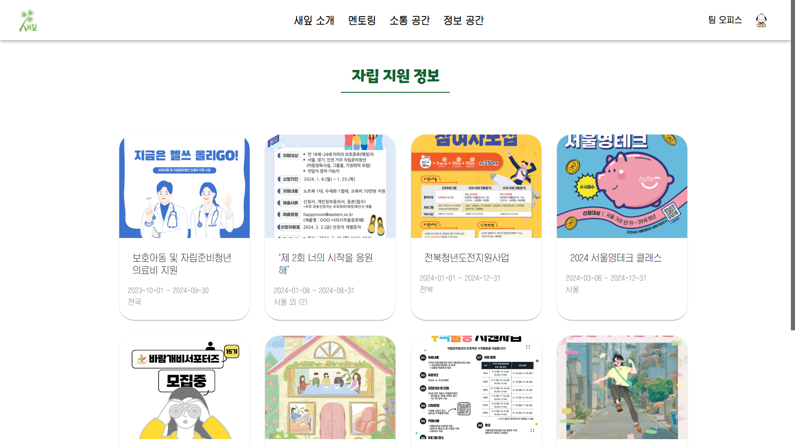

---

## 5. 챗GPT를 이용한 AI 챗봇 기능

### 주요 기능
- **실시간 상담**: 챗GPT 기반의 AI 챗봇을 통해 사용자가 실시간으로 다양한 질문에 대한 답변을 받을 수 있습니다.
- **상황 맞춤형 답변**: 사용자의 질문에 따라 AI가 상황에 맞는 맞춤형 답변을 제공합니다.
- **연속 대화**: 사용자는 연속적인 대화를 통해 복잡한 문제 해결이나 상담을 받을 수 있습니다.

### 시나리오
1. 사용자가 AI 챗봇에 질문을 입력합니다.
2. 챗GPT가 실시간으로 해당 질문에 대한 답변을 제공합니다.
3. 사용자는 추가 질문을 통해 더 깊이 있는 상담을 이어갈 수 있습니다.

### 캡처 이미지
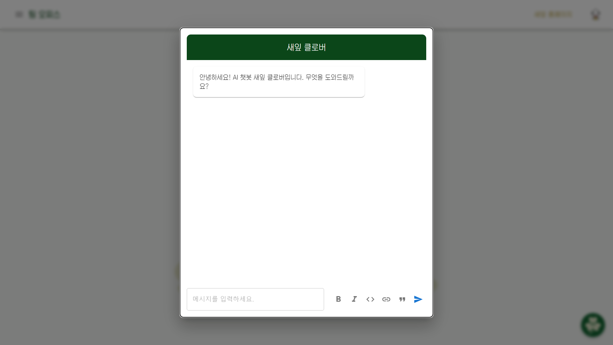

---

## 결론
이 서비스는 WebRTC, WebSocket, ResNet152, 웹 크롤링, 챗GPT 등 다양한 최신 기술을 활용하여 멘토링, 그룹 채팅, 이미지 분류, 자립 정보 제공, AI 챗봇과 같은 기능을 제공합니다. 각 기능은 사용자가 쉽고 편리하게 접근할 수 있도록 설계되어 있으며, 시나리오를 통해 사용자 경험을 구체적으로 안내합니다.

