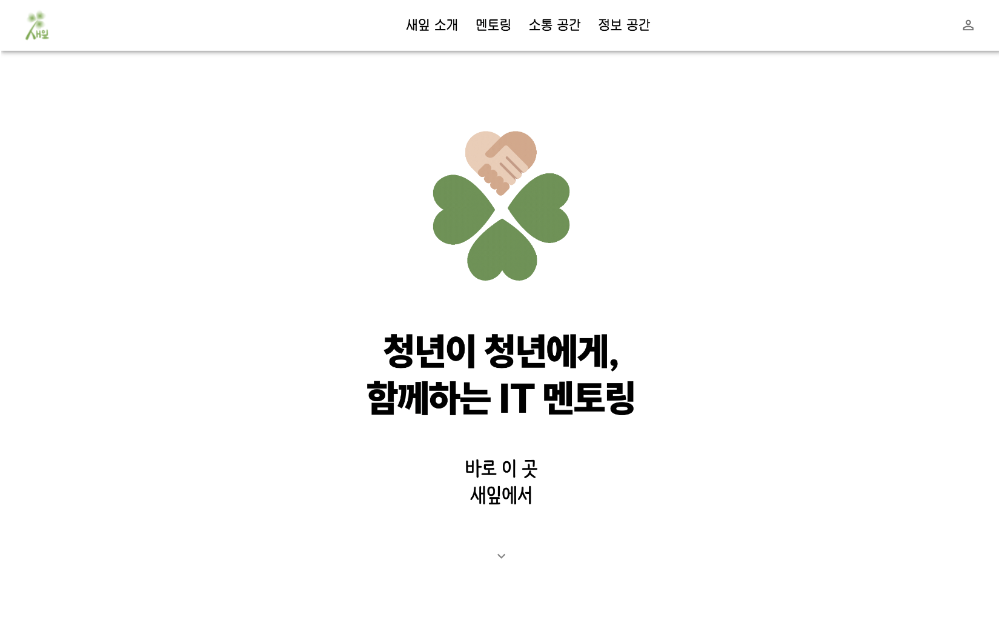
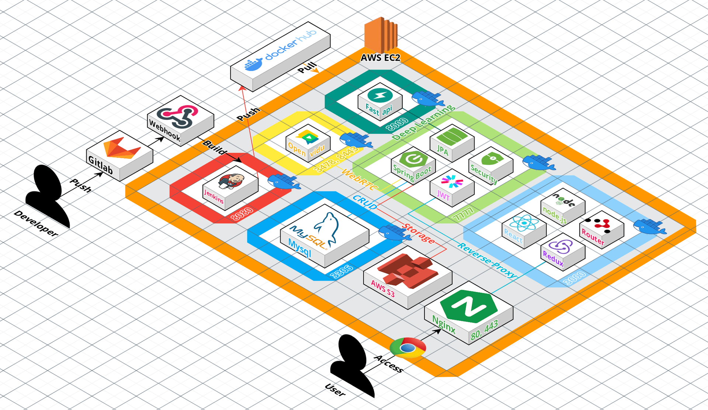

<h1>
    

        
        자립준비청년을 위한 IT 멘토링 서비스, 새잎
    

</h1>

    

 

    <h2 style="text-align: center">
        
🌱 IT 멘토링을 통해 함께 새싹을 키우세요 🌱  💻자립준비청년을 위한 맞춤형 IT 지원💻

    </h2>
    
<b>"IT 분야에 관심은 있지만, 어디서부터 시작해야 할지 막막한가요?"</b>

    
<b>"함께 이야기하며 고민을 털어놓을 멘토가 필요한가요?"</b>

     
    
걱정하지 마세요! <b>새잎 멘토링 서비스</b>와 함께라면 기초부터 차근차근 배워나갈 수 있어요 🌿  SSAFY생과의 <b>맞춤형 커리큘럼 및 팀 활동으로</b>으로 IT 기초 교육과 친한 형, 누나를 만나보세요.  언제든지 편하게 질문하고, 성장의 과정을 함께 나누세요 🌟

     
    
새잎과 함께 여러분의 꿈을 이루는 여정을 시작하세요 🚀

     
      <h3>
        🔗 <a href="https://i11e107.p.ssafy.io/">서비스 이용하기(EC2 서버 만료로 인해 닫힘)</a>
         
         
        🎥 <a href="https://youtu.be/-QTPgHNz_L8">새잎 홍보영상</a>
         
         
        🔖 <a href="Home.md">주요 기능 및 시나리오</a>
      </h3>
       
    

        💡 <a href="https://www.notion.so/a58dc595f0434a458d83e007d21438fb?pvs=4">기획서</a>
        |
        📚 <a href="https://www.notion.so/6d1e435901e347ce840c192d9c668552?pvs=4">기술블로그</a>
        |
        🗒️ <a href="https://www.notion.so/SSAFY-ca198dabf2344acd82a0f551cad85ed5?pvs=4">팀 노션</a>
    

 

## 목차

- [새잎팀의 성과](#-새잎팀의-성과)
- [🚀 핵심기능](#-핵심기능)
  - [단비(멘토)와의 멘토링](#it-멘토링)
  - [자립준비청년을 위한 정보](#)
- [기술적 도전](#기술적-도전)
  - [WebRTC를 이용한 P2P 통신](#)
  - [WebSocket을 이용한 그룹채팅](#)
  - [챗GPT API를 활용한 챗봇](#)
  - [ResNet152을 활용한 이미지 분류 모델](#)
- [도전과 해결💡](#도전과-해결)
  - [서비스 안정화](#서비스-안정화)
  - [사용자 경험 개선](#사용자-경험-개선)
- [시스템 아키텍처](#시스템-아키텍처)
- [기술 스택](#기술-스택)

 

## 새잎팀의 성과

### 🏆 SSAFY 11기 2학기 공통 우수 프로젝트 🏆
### ✌️ SSAFY 11기 2학기 공통프로젝트 UCC경진대회 최종 2등 ✌️
 

## 🚀 핵심기능

### IT 멘토링

> 자립준비청년들이 SSAFY생과 멘토링 팀을 맺고, IT 기초 수업을 받을 수 있습니다.
> 수업뿐만 아니라 함께 식물키우기, 챌린지 기능, 사연함 등을 통하여 유대감 및 정서적 공감대를 형성할 수 있습니다.
> 수업에 필요한 자료 및 QnA 게시판을 통해 질의응답을 할 수 있습니다.
> 퀴즈를 통하여 복습을 할 수 있습니다.

### 자립준비청년들에게 필요한 정보를 제공해줘요.

> 자립준비청년을 대상으로 하는 행사 또는 지원에 대한 정보를 얻을 수 있습니다.

 

## 기술적 도전

### WebRTC를 이용한 P2P 통신

> WebRTC 기술을 활용하여 실시간 P2P 통신을 구현했습니다. 새잎(자립준비청년)과 단비(멘토)들이 직접적인 영상 통화를 통해 IT 멘토링을 진행할 수 있습니다. 이 과정에서 브라우저 간 호환성 문제를 해결하고, 네트워크 상태에 따른 품질 저하를 최소화하는 데 집중했습니다.

### WebSocket을 이용한 그룹채팅

> 실시간 그룹 채팅 기능을 WebSocket을 통해 구현했습니다. 자립준비청년들과 SSAFY생이 실시간으로 서로 소통할 수 있도록 하였으며, 이를 통해 다양한 주제의 토론과 질의응답을 원활히 진행할 수 있게 했습니다.

### 챗GPT API를 활용한 챗봇

> 챗GPT API를 연동하여 자립준비청년들이 24시간 질문하고 답변을 받을 수 있는 챗봇 기능을 구현했습니다. IT 수업에 대한 궁금증이나 실생활에서 발생하는 문제들에 대해 챗봇을 통해 즉각적인 도움을 받을 수 있습니다.

### ResNet152을 활용한 이미지 분류 모델

> ResNet152 모델을 활용하여 이미지 분류 기능을 구현했습니다. 챌린지 기능에서 사용자가 업로드한 이미지를 분석하여 챌린지에 알맞은 이미지인지 판단해줍니다.

 

 

## 도전과 해결 💡

> 새잎 서비스의 기술적 도전과 문제 해결 과정

### 서비스 안정화

- 여러 사용자들이 동시에 접속하는 상황에서도 안정적인 성능을 유지할 수 있도록 시스템을 개선했습니다.
- 테스트 자동화 도구를 도입하여 서비스의 신뢰성을 확보했습니다.

### 사용자 경험 개선

- 사용자 피드백을 반영하여 UI/UX를 지속적으로 개선했습니다.
- 모바일 최적화를 통해 언제 어디서나 서비스에 접근할 수 있도록 했습니다.

 

## 시스템 아키텍처

 

## 기술 스택

<table>
  <th>구분</th>
  <th>기술 스택</th>
  <tr>
    <td align="center"><b>frontend</b></td>
    <td>
      
      
      
      
    </td>
  </tr>
  <tr>
    <td align="center"><b>backend</b></td>
    <td>
      
      
      
      
      
      
      
    </td>
  </tr>
  <tr>
    <td align="center"><b>DB</b></td>
    <td>
      
    </td>
  </tr>
  <tr>
    <td align="center"><b>CI/CD</b></td>
    <td>
      
      
      
      
    </td>
  </tr>
  <tr>
    <td align="center"><b>Cooperation</b></td>
    <td>
      
      
        
      
    </td>
  </tr>
</table>

## 팀원 소개 및 역할

| 이름   | 기능 및 역할                        |
| ------ | --------------------------- |
| 박연후 | 팀장, 백엔드 & 프론트엔드 보조, Web Crawling을 통한 지원 사업 조회 |
| 권정솔 | 백엔드 & 프론트엔드 보조, WebRTC를 이용한 화상 서비스 구현 |
| 배선영 | 프론트엔드 팀장, 인프라 보조, 전반적인 프론트엔드 구현 |
| 방혁 | 백엔드 팀장, JWT 및 SpringSecurity를 이용한 로그인 구현, AI/ML 모델링 |
| 이승지 | 백앤드 & 프론트엔드 보조, WebSocket을 이용한 팀채팅 구현 |
| 이창호 | 인프라, 백엔드 & 프론트엔드 보조, 아키텍처 설계 및 DevOps 구축 |

